<div align="center">


<h1>Database Point-in-Time Recovery (PITR)</h1>

<p><strong>The Enterprise Standard for Designing, Automating, and Governing Granular Resilience and High-Integrity Recovery</strong></p>

[]()
[]()
[]()
[]()

<br/>

> **"Resilience is not just having a backup; it's the ability to rewind time with precision."** 
> Database Point-in-Time Recovery is a flagship platform designed to enable enterprises to design, automate, and validate granular recovery across multi-cloud and hybrid environments.

</div>

---

## 🏛️ Executive Summary

**Database Point-in-Time Recovery (PITR)** is a flagship repository designed for Chief Technology Officers (CTOs), SREs, and Database Reliability Architects. In an era of high-frequency transactions and persistent ransomware threats, simple "Nightly Backups" are insufficient.

This platform provides an industrialized approach to **Resilience Engineering**, delivering production-ready **Recovery Engines**, **Transaction Log Orchestrators**, **Automated Drill Workflows**, and **RPO/RTO Dashboards**. It supports **PostgreSQL**, **Oracle**, **SQL Server**, **Snowflake**, and **BigQuery**, enabling teams to recover data to any specific microsecond with absolute integrity.

---

## 💡 Why PITR Matters

PITR is the "Safety Net" of the digital estate:
- **Granular Recovery**: Reversing accidental deletes or table corruption without losing all data since the last backup.
- **Ransomware Defense**: Rolling back to a "Clean State" just seconds before an encryption event.
- **Compliance & Audit**: Providing evidence of recovery capabilities through automated, validated drills.
- **Business Continuity**: Minimizing RPO (Recovery Point Objective) to near-zero for mission-critical systems.

---

## 🚀 Business Outcomes

### 🎯 Strategic Resilience Impact
- **Sub-Minute RPO**: Achieving near-zero data loss by continuously archiving transaction logs.
- **Automated Validation**: Moving from "Hope-based Backups" to "Proven Recoverability" via scheduled drills.
- **Operational Efficiency**: Enabling self-service recovery for non-critical environments (Dev/Test).
- **Reduced Downtime**: Accelerating RTO (Recovery Time Objective) through optimized snapshot + log replay orchestration.

---

## 🏗️ Technical Stack

| Layer | Technology | Rationale |
|---|---|---|
| **Recovery Engine** | Python, Ansible (optional) | High-performance orchestration of restore and log replay tasks. |
| **Control Plane** | FastAPI | High-performance API for request management and drill scheduling. |
| **Frontend** | React 18, Vite | Premium portal for recovery portfolio board, drill planning, and scorecards. |
| **IaC Foundation** | Terraform | Multi-cloud infrastructure consistency and vault automation. |
| **Database** | PostgreSQL | Centralized repository for backup metadata, log chains, and state. |
| **Observability** | Prometheus / Grafana | Real-time monitoring of RPO health and restoration duration. |

---

## 📐 Architecture Storytelling: 65+ Diagrams

### 1. Executive High-Level Architecture
The holistic vision of the enterprise recovery journey.

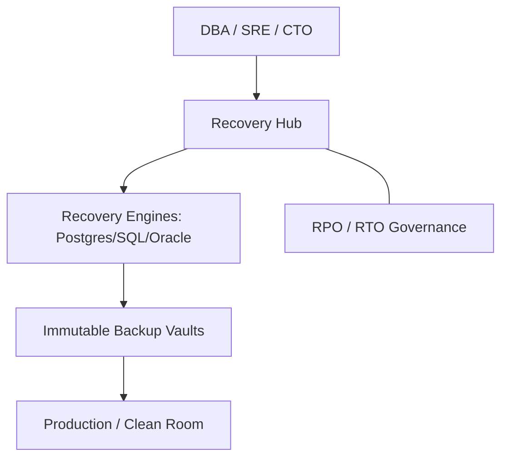

### 2. Detailed Component Topology
The internal service boundaries and management layers of the platform.

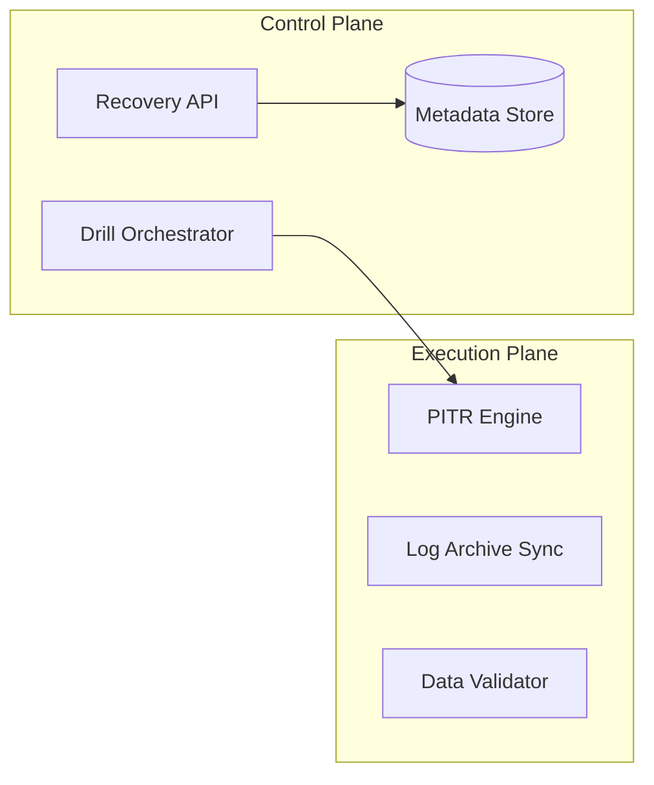

### 3. Frontend to Backend Request Path
Tracing a "Restore to Timestamp" request through the stack.

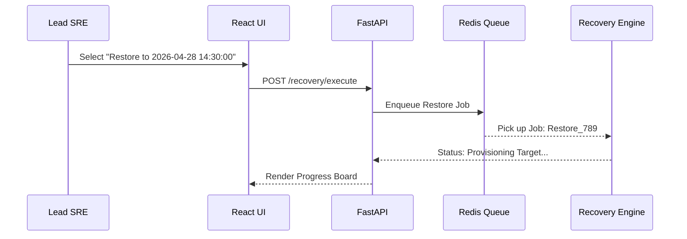

### 4. Recovery Control Plane
The "Brain" of the framework managing cross-region recovery definitions.

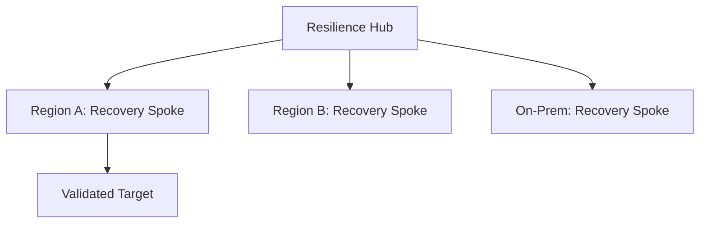

### 5. Multi-Cloud Target Topology
Synchronizing recovery standards across Azure, AWS, GCP, and Hybrid.

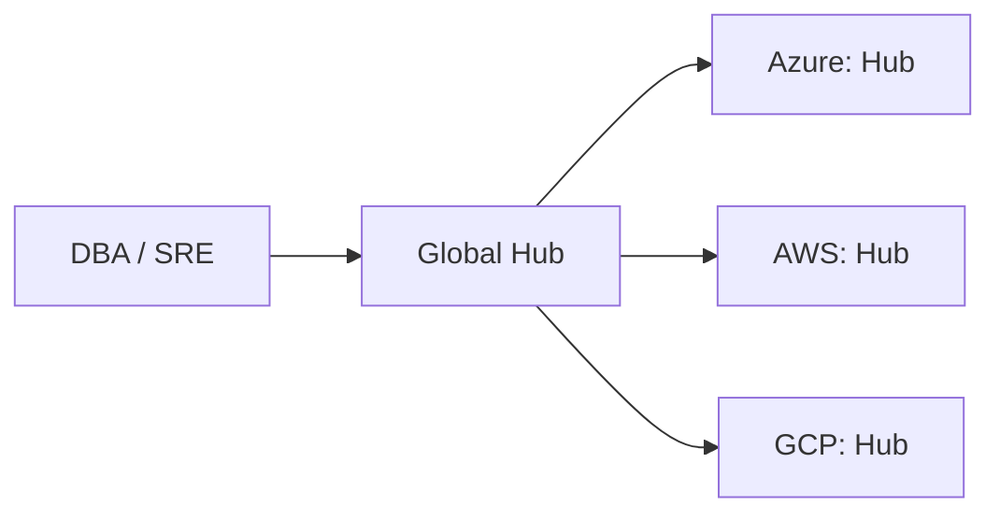

### 6. Regional Deployment Model
Hosting recovery workers close to the vaults for performance.

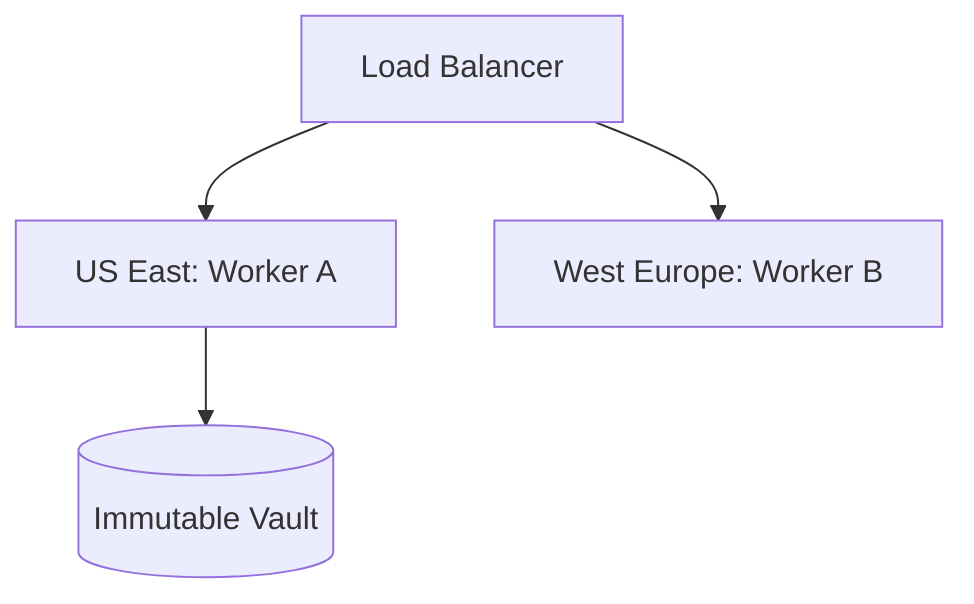

### 7. DR Failover Model
Ensuring recovery continuity during regional cloud outages.

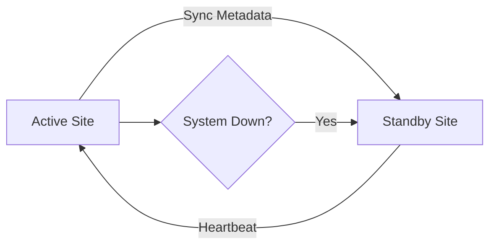

### 8. API Gateway Architecture
Securing and throttling the entry point for recovery orchestration.

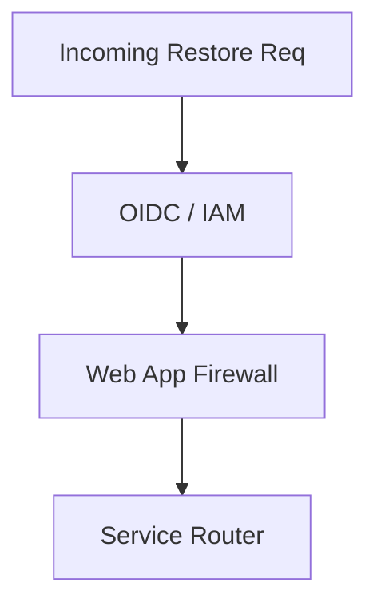

### 9. Queue Worker Architecture
Managing long-running restore and validation tasks at scale.

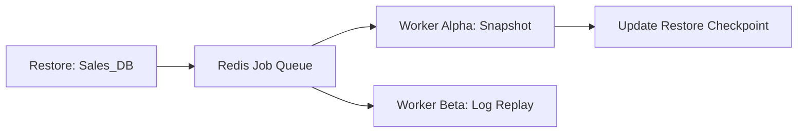

### 10. Dashboard Analytics Flow
How raw recovery telemetry becomes executive resilience scorecards.

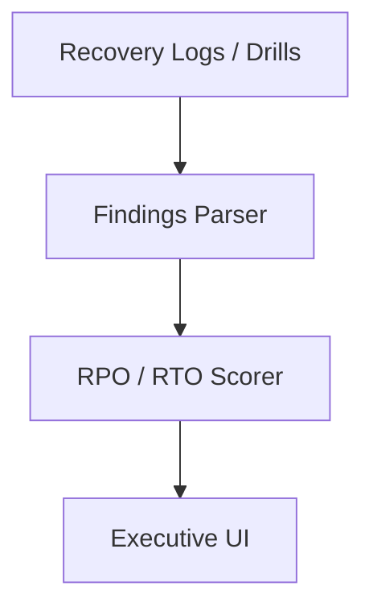

### 11. Full Backup + Log Chain Model
Visualizing the dependency of logs on the base snapshot.


### 12. Snapshot + Log Replay Workflow
Orchestrating the multi-step recovery process.

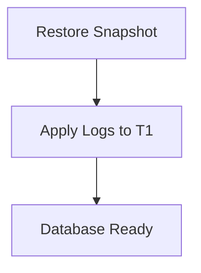

### 13. Restore to Timestamp Process
Seeking the exact moment of recovery within the log stream.


### 14. WAL Replay Lifecycle
PostgreSQL Write-Ahead Logging recovery cycle.

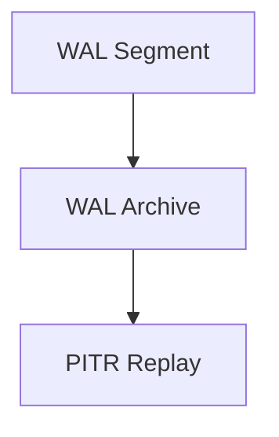

### 15. Binlog Recovery Model
MySQL Binary Log recovery architecture.


### 16. Redo Log Restore Workflow
Oracle high-performance redo log recovery.

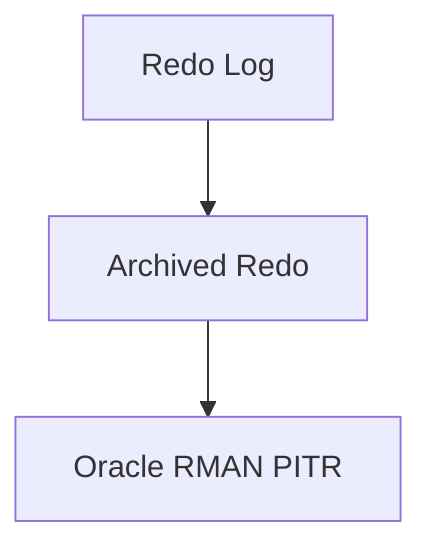

### 17. Incremental Backup Chain
Reducing base snapshot sizes with block-level increments.

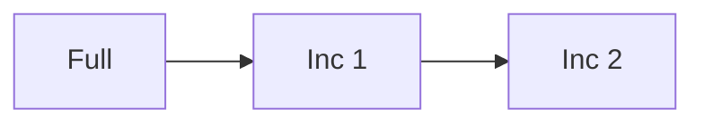

### 18. Recovery Checkpoint Model
Optimizing RTO by creating intermediate recovery points.

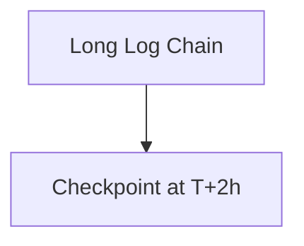

### 19. Self-Service Restore Request
Enabling developers to trigger non-prod refreshes.

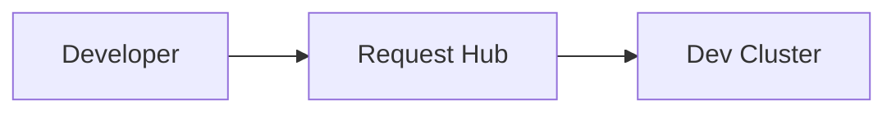

### 20. Approval Workflow for Restore
Governing production data overrides.

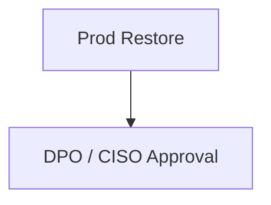

### 21. PostgreSQL PITR Flow
Azure Database for PostgreSQL / AWS RDS PG patterns.

```mermaid
graph LR
    PG[Postgres] --> WAL[WAL-G / WAL-E]
    WAL --> S3[Cloud Storage]
```

### 22. MySQL PITR Flow
Standardized cloud-native MySQL backup orchestration.

```mermaid
graph TD
    My[MySQL] --> Snap[Cloud Snapshot]
    Snap --> Log[Binlog Replay]
```

### 23. SQL Server PITR Model
Azure SQL / Managed Instance log backup chain.

```mermaid
graph LR
    SQL[MSSQL] --> Tlog[Transaction Logs]
    Tlog --> Vault[SQL Vault]
```

### 24. Oracle Recovery Model
Using RMAN for enterprise-grade PITR.

```mermaid
graph TD
    Ora[Oracle] --> RMAN[Recovery Manager]
```

### 25. MongoDB Oplog Restore
NoSQL granular recovery using the Operations Log.

```mermaid
graph LR
    Mongo[MongoDB] --> Oplog[Oplog Archive]
```

### 26. Cassandra Repair + Restore
Managing consistency across the ring during recovery.

```mermaid
graph TD
    Ring[Cassandra Cluster] --> Restore[Snapshot Restore]
    Restore --> Repair[Node Repair]
```

### 27. DynamoDB Backup Recovery
AWS native point-in-time recovery.

```mermaid
graph LR
    DDB[DynamoDB] --> PITR[PITR Enabled]
```

### 28. Snowflake Time Travel Model
Zero-copy cloning for historical recovery.

```mermaid
graph TD
    SF[Snowflake] --> Clone[Zero-Copy Clone at T-1h]
```

### 29. BigQuery Snapshot Recovery
GCP native table snapshotting and restore.

```mermaid
graph LR
    BQ[BigQuery] --> Snap[Snapshot API]
```

### 30. Synapse Restore Pattern
Azure Synapse Dedicated Pool restore points.

```mermaid
graph TD
    Syn[Synapse] --> RP[Restore Point]
```

### 31. Ransomware Clean-Room Recovery
Restoring to an isolated VNet for inspection.

```mermaid
graph LR
    Vault[Immutable Vault] --> Room[Clean Room VNet]
```

### 32. Accidental Delete Recovery Flow
Restoring just the affected table or row.

```mermaid
graph TD
    Delete[Drop Table] --> PITR[Restore to T-1m]
```

### 33. Corruption Rollback Workflow
Identifying and reversing logical data corruption.

```mermaid
graph LR
    Bug[App Bug] --> Rollback[PITR to Pre-Bug]
```

### 34. Credential Compromise Response
Securing the backup vault after an identity breach.

```mermaid
graph TD
    Breach[IAM Compromise] --> Rotate[Key Rotation]
```

### 35. Immutable Backup Vault Model
Protecting backups from deletion or modification.

```mermaid
graph LR
    Policy[Lock Policy] --> Bucket[WORM Storage]
```

### 36. Air-Gapped Copy Workflow
Moving backups to a physically or logically isolated account.

```mermaid
graph TD
    Primary[Main Account] --> Sync[Secure Cross-Account Copy]
```

### 37. Cross-region Vault Replication
Preparing for regional cloud provider failures.

```mermaid
graph LR
    East[East US] --> West[West US]
```

### 38. Backup Encryption Lifecycle
Managing keys for data-at-rest protection.

```mermaid
graph TD
    Data[Backup] --> KMS[Key Management Service]
```

### 39. Key Rotation Recovery Impact
Ensuring old backups remain readable after rotation.

```mermaid
graph LR
    KeyV1[Key V1] --> B1[Backup 1]
    KeyV2[Key V2] --> B2[Backup 2]
```

### 40. Forensics Evidence Workflow
Providing snapshots to the legal/security teams.

```mermaid
graph TD
    Case[Legal Case] --> Export[Secure Snapshot Export]
```

### 41. Scheduled Restore Drill Flow
The rhythm of automated recoverability testing.

```mermaid
graph LR
    Timer[Schedule] --> Run[Execute Drill]
```

### 42. Recovery Time Measurement
Tracking RTO against the SLA.

```mermaid
graph TD
    Start[Restore Start] --> End[Restore Ready]
    End --> Calc[Duration: 14m]
```

### 43. Data Consistency Validation
Running checksums after restoration.

```mermaid
graph LR
    Src[Checksum A] == Tgt[Checksum B]
```

### 44. Application Reconnect Testing
Verifying the app can talk to the restored DB.

```mermaid
graph TD
    App[Frontend] --> Probe[Health Check]
```

### 45. DR Tabletop Exercise
Simulating a failure and running the orchestration.

```mermaid
graph LR
    Scenario[Region Down] --> Plan[Execute Playbook]
```

### 46. Chaos Recovery Workflow
Injecting failures during the restore process.

```mermaid
graph TD
    Restore[Restore] --> Inject[Kill Worker]
    Inject --> Resume[Self-Heal]
```

### 47. Runbook Attestation Model
Logging every step of the recovery for compliance.

```mermaid
graph LR
    Action[Mount Disk] --> Log[(Audit Trail)]
```

### 48. Evidence Collection Workflow
Automating the gathering of drill results.

```mermaid
graph TD
    Drill[Drill Results] --> Repo[Compliance Repo]
```

### 49. SLA Acceptance Gate
Approving a system for production use post-restore.

```mermaid
graph LR
    Check[Checklist] --> SignOff[PPO Approval]
```

### 50. Audit Review Cycle
Quarterly review of resilience posture.

```mermaid
graph TD
    Audit[Q1 Audit] --> Remediation[Task List]
```

### 51. Backup Health Monitoring
Real-time tracking of backup success/failure.

```mermaid
graph LR
    Jobs[Backup Jobs] --> Dashboard[Health Status]
```

### 52. Metrics Pipeline
Monitoring the performance of the recovery hub.

```mermaid
graph TD
    Hub[Hub] --> Prom[Prometheus]
```

### 53. Logging Architecture
Centralized recovery logs.

```mermaid
graph LR
    Pod[Hub Pod] --> Loki[Grafana Loki]
```

### 54. Tracing Model
Tracing restore requests across distributed workers.

```mermaid
graph TD
    Req[Start] --> Trace[OTel Trace]
```

### 55. Alert Routing Workflow
Sending RPO breach alerts to the right team.

```mermaid
graph LR
    Breach[RPO > 15m] --> PagerDuty[On-Call Alert]
```

### 56. Queue Backlog Recovery Jobs
Managing worker spikes during mass outages.

```mermaid
graph TD
    Queue[100 Jobs] --> Scaler[Auto-Scale Workers]
```

### 57. Capacity Planning Model
Forecasting storage growth for long log chains.

```mermaid
graph LR
    Growth[5GB / Day] --> Forecast[Limit Reached: 6mo]
```

### 58. Release Pipeline Workflow
Continuous delivery of the resilience platform.

```mermaid
graph TD
    Git[Code] --> GHA[Deploy]
```

### 59. Change Governance Workflow
Governing updates to recovery runbooks.

```mermaid
graph LR
    Edit[Runbook v2] --> Review[SRE Peer Review]
```

### 60. Cost Optimization Lifecycle
Cleaning up old snapshots and logs.

```mermaid
graph TD
    Policy[Retention: 30d] --> Cleanup[Delete Stale]
```

### 61. Executive KPI Review Cycle
Reporting RPO/RTO achievement to the Board.

```mermaid
graph LR
    Stats[Resilience Stats] --> Slide[Board Deck]
```

### 62. RPO Scorecard Workflow
Ranking databases by their data loss risk.

```mermaid
graph TD
    DBs[DBs] --> Rank[P0: 99.9%, P3: 80%]
```

### 63. RTO Heatmap Model
Visualizing restoration times across the estate.

```mermaid
graph LR
    Data[RTO Times] --> Heatmap[Red/Amber/Green]
```

### 64. Recovery Readiness Maturity
Mapping the journey to industrialized resilience.

```mermaid
graph TD
    P1[Manual] --> P4[Autonomous]
```

### 65. Annual Resilience Roadmap
The strategic vision for the next 12 months.

```mermaid
graph LR
    Q1[Vault Hardening] --> Q4[Full Automation]
```

---

## 🔬 PITR Recovery Methodology

### 1. The Resilience Pillars
Our platform is built on four core pillars:
- **Precision**: Restoring to the exact microsecond required to minimize data loss.
- **Verification**: Continuously proving that backups are restorable and consistent.
- **Isolation**: Recovering into clean environments to prevent re-infection or cross-contamination.
- **Auditability**: Providing an immutable trail of every backup and recovery action.

### 2. PITR Technical Foundations
- **Base Snapshot**: A point-in-time image of the database.
- **Log Stream**: A continuous record of every change since the base snapshot (WAL, Binlog, etc.).
- **Log Replay**: The process of applying logs sequentially to the base snapshot to reach a target time.

---

## 🚦 Getting Started

### 1. Prerequisites
- **Terraform** (v1.5+).
- **Docker Desktop**.
- **Azure/AWS/GCP CLI** configured.

### 2. Local Setup
```bash
# Clone the repository
git clone https://github.com/Devopstrio/database-point-in-time-recovery.git
cd database-point-in-time-recovery

# Start the Recovery Control Plane
docker-compose up --build
```
Access the Recovery Portal at `http://localhost:3000`.

---

## 🛡️ Governance & Security
- **Immutable Storage**: Backups are stored in WORM-compliant (Write Once Read Many) vaults.
- **Identity-First Recovery**: All recovery requests require multi-factor authentication and role-based approval.
- **Encryption-in-Depth**: Data is encrypted at rest using regional HSM keys and in transit via mTLS 1.3.

---
<sub>&copy; 2026 Devopstrio &mdash; Engineering the Future of Industrialized Database Resilience.</sub>
