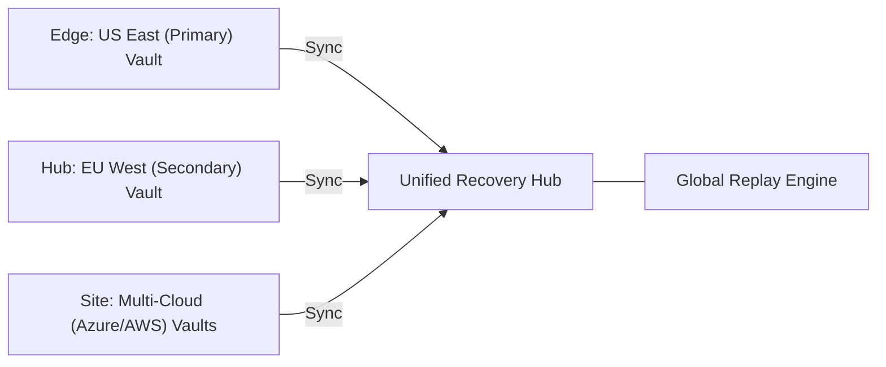
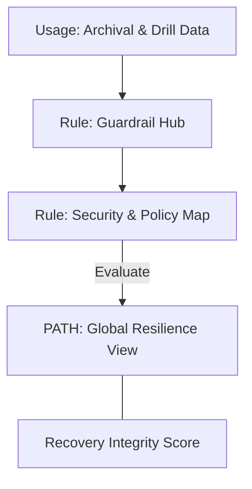
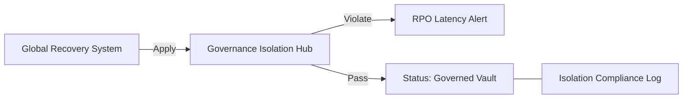
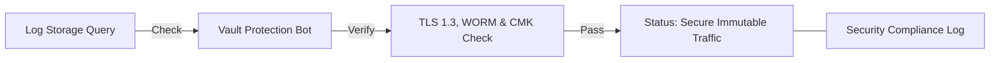
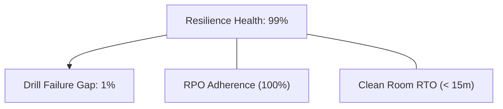
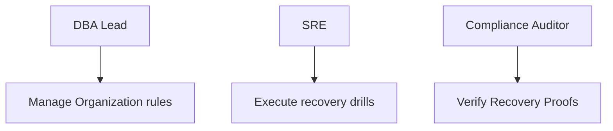
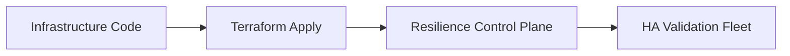
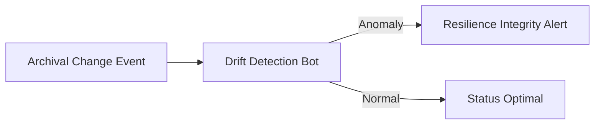
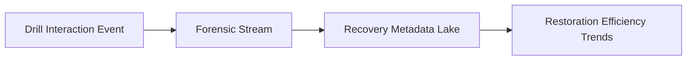

<div align="center">


<h1>Database Point-in-Time Recovery (PITR)</h1>

<p><strong>The Institutional-Grade Platform for Standardized Granular Resilience, Recovery Orchestration, and Multi-Cloud Database Continuity Ecosystems.</strong></p>

[]()
[]()
[]()

<br/>

> **"Industrializing recovery to automate absolute data resilience."** 
> **Database Point-in-Time Recovery** is an enterprise-grade platform designed to provide a secure, measurable, and highly automated foundation for global database continuity operations. It orchestrates the complex lifecycle of granular recovery—from transaction log archival and immutable vaulting to continuous drill validation and unified RPO auditing.

</div>

---

## 🏛️ Executive Summary

Fragmented backup scripts and manual log replays are strategic operational liabilities; lack of centralized Point-in-Time Recovery (PITR) orchestration is a primary barrier to organizational business continuity and ransomware defense. Organizations fail to recover cleanly not because of a lack of backups, but because of fragmented archival standards, lack of automated drill validation, and an inability to orchestrate recovery planes with microsecond precision.

This repository provides the **Recovery Intelligence Plane**. It implements a complete **PITR-as-Code Framework**, enabling SRE and Database Reliability teams to manage global resilience foundations as first-class citizens. By automating the identification of recovery bottlenecks through real-time log telemetry analysis and orchestrating the provisioning of secure performance-driven recovery policies, we ensure that every organizational database—from high-throughput PostgreSQL to legacy SQL Server—is protected by default, audited for history, and strictly aligned with institutional RPO/RTO frameworks.

---

## 📐 Architecture Storytelling: Principal Reference Models

### 1. Principal Architecture: Global Database PITR & Recovery Intelligence Plane
This diagram illustrates the end-to-end flow from transaction log archival and multi-cloud orchestration to recovery enforcement, data validation, and institutional resilience auditing.


```mermaid
graph LR
    %% Subgraph Definitions
    subgraph DataIngress["Live Database & Log Ingress"]
        direction TB
        Live_DBs["PostgreSQL / MySQL / Oracle / SQL Server"]
        Log_Streams["WAL / Binlog / Redo Logs"]
        Base_Snaps["Continuous Base Snapshots"]
    end

    subgraph IntelligenceEngine["Recovery Intelligence Hub"]
        direction TB
        API["FastAPI Resilience Gateway"]
        RecoveryOrchestrator["Global Replay & Drill Hub"]
        Governance_Hub["Compliance & Audit Guardrail Hub"]
        AIOps_Validator["Drift & RPO Analysis Hub"]
    end

    subgraph OperationsPlane["Distributed Recovery Ecosystem"]
        direction TB
        ManagedVaults["Managed Immutable Storage Vaults"]
        ActiveDrills["Managed Automated Recovery Pipelines"]
        CleanRooms["Managed Isolated Restoration Environments"]
    end

    subgraph OperationsHub["Institutional Resilience Hub"]
        direction TB
        Scorecard["Recovery Maturity Scorecard"]
        Analytics["Drill Success & RTO Velocity Stats"]
        Audit["Forensic Recovery Metadata Lake"]
    end

    subgraph DevOps["PITR-as-Code Framework"]
        direction TB
        TF["Terraform Vault Modules"]
        DriftBot["Archival & Config Drift Validator"]
        ChatOps["Continuity Operations Hub"]
    end

    %% Flow Arrows
    DataIngress -->|1. Stream Logs| API
    API -->|2. Orchestrate Archival| RecoveryOrchestrator
    RecoveryOrchestrator -->|3. Apply WORM Guard| Governance_Hub
    Governance_Hub -->|4. Assess RPO Drift| AIOps_Validator
    
    AIOps_Validator -->|5. Execute Drill| OperationsPlane
    OperationsPlane -->|6. Notify Status| ChatOps
    API -->|7. Visualize Health| Scorecard
    
    Scorecard -->|8. Track Maturity| Analytics
    Scorecard -->|9. Record Drill| Audit
    
    TF -->|10. Provision Backbone| IntelligenceEngine
    DriftBot -->|11. Inject Resilience Risk| RecoveryOrchestrator
    Audit -->|12. Improve Operations| ManagedVaults

    %% Styling
    classDef ingress fill:#f5f5f5,stroke:#616161,stroke-width:2px;
    classDef intel fill:#e8eaf6,stroke:#1a237e,stroke-width:2px;
    classDef operations fill:#e1f5fe,stroke:#01579b,stroke-width:2px;
    classDef ops fill:#ede7f6,stroke:#311b92,stroke-width:2px;
    classDef devops fill:#e8f5e9,stroke:#1b5e20,stroke-width:2px;

    class DataIngress ingress;
    class IntelligenceEngine intel;
    class OperationsPlane operations;
    class OperationsHub ops;
    class DevOps devops;
```

### 2. The Granular Recovery Lifecycle Flow
The continuous path of a PITR platform from initial base snapshot and log archival to active replay orchestration, integrity validation, and institutional forensic auditing (RPO).


```mermaid
graph LR
    Snapshot["Snapshot (Base)"] --> Archive["Archive (Logs)"]
    Archive --> Orchestrate["Orchestrate (Replay)"]
    Orchestrate --> Validate["Validate (Integrity)"]
    Validate --> Audit["Audit & RPO"]
```

### 3. Distributed Vault Topology
Strategically orchestrating standardized immutable vaults across global regions, diverse database platforms, and multi-cloud environments, providing a unified institutional view of global data resilience.


```mermaid
graph LR
    RegionA["Edge: US East (Primary) Vault"] -->|Sync| Hub["Unified Recovery Hub"]
    BU["Hub: EU West (Secondary) Vault"] -->|Sync| Hub
    Cloud["Site: Multi-Cloud (Azure/AWS) Vaults"] -->|Sync| Hub
    Hub --- Logic["Global Replay Engine"]
```

### 4. Resilience Governance & High-Trust Data Plane Protection Flow
Executing complex logic for securing the bridge between live databases, immutable vaults, and clean room recovery targets, ensuring every organizational identity is verified and every restore access is according to institutional standards.


```mermaid
graph TD
    RecoveryData["Usage: Archival & Drill Data"] --> Bridge["Rule: Guardrail Hub"]
    Bridge --> PolicyMap["Rule: Security & Policy Map"]
    PolicyMap -->|Evaluate| Context["PATH: Global Resilience View"]
    Context --- Estimate["Recovery Integrity Score"]
```

### 5. Multi-Cloud Recovery Federation Flow
Automatically managing unified Point-in-Time standards across PostgreSQL, MySQL, SQL Server, and Oracle, ensuring institutional archival consistency and ransomware boundaries by default.


```mermaid
graph LR
    Org["Global Recovery System"] -->|Apply| Guard["Governance Isolation Hub"]
    Guard -->|Violate| Alert["RPO Latency Alert"]
    Guard -->|Pass| Verify["Status: Governed Vault"]
    Verify --- Audit["Isolation Compliance Log"]
```

### 6. Encryption & Perimeter Protection Flow (Resilience Standard)
Managing the lifecycle of a log archival request, automatically enforcing institutional TLS 1.3, WORM (Write Once Read Many) policies, and CMK encryption standards as required by security policy.


```mermaid
graph LR
    ArchivalReq["Log Storage Query"] -->|Check| Gatekeeper["Vault Protection Bot"]
    Gatekeeper -->|Verify| TLS["TLS 1.3, WORM & CMK Check"]
    TLS -->|Pass| Admit["Status: Secure Immutable Traffic"]
    Admit --- Audit["Security Compliance Log"]
```

### 7. Institutional Resilience Maturity Scorecard
Grading organizational performance based on key indicators: RPO Adherence, Drill Success Rates, and Clean Room Setup Times.


```mermaid
graph TD
    Post["Resilience Health: 99%"] --> Risk["Drill Failure Gap: 1%"]
    Post --- C1["RPO Adherence (100%)"]
    Post --- C2["Clean Room RTO (< 15m)"]
```

### 8. Identity & RBAC for Recovery Governance
Managing fine-grained access to recovery hubs, provisioning clean rooms, and audit logs between DBA Leads, SREs, and Compliance Auditors.


```mermaid
graph TD
    DBALead["DBA Lead"] --> Hub["Manage Organization rules"]
    SRE["SRE"] --> Exec["Execute recovery drills"]
    Auditor["Compliance Auditor"] --> Audit["Verify Recovery Proofs"]
```

### 9. IaC Deployment: PITR-as-Code Framework
Using modular Terraform to deploy and manage the versioned distribution of the recovery tracking hubs, policy protection workers, and forensic metadata lakes.


```mermaid
graph LR
    HCL["Infrastructure Code"] --> TF["Terraform Apply"]
    TF --> Engine["Resilience Control Plane"]
    Engine --> Clusters["HA Validation Fleet"]
```

### 10. AIOps Recovery Drift & Risk Validation Flow
Using advanced analytics to identify sudden surges in log archival failures, unauthorized vault access, suspicious configuration drifts, or unusual replay pattern changes that could result in institutional risk or data loss.


```mermaid
graph LR
    Drift["Archival Change Event"] --> Analyzer["Drift Detection Bot"]
    Analyzer -->|Anomaly| Alert["Resilience Integrity Alert"]
    Analyzer -->|Normal| Pass["Status Optimal"]
```

### 11. Metadata Lake for Forensic Recovery Audit
Storing long-term records of every log archived (metadata), every recovery drill executed, and every RTO timeline history for institutional record-keeping, compliance auditing, and post-provisioning forensics.


```mermaid
graph LR
    Provision["Drill Interaction Event"] --> Stream["Forensic Stream"]
    Stream --> Lake["Recovery Metadata Lake"]
    Lake --> Trends["Restoration Efficiency Trends"]
```

---

## 🏛️ Core Governance Pillars

1.  **Unified Foundation Coordination**: Maximizing resilience by centralizing all PITR workflows through a single institutional plane.
2.  **Automated Drill Provisioning**: Eliminating "manual testing" scenarios through proactive orchestration and pattern verification.
3.  **Sequential Recovery Intelligence**: Ensuring zero-interruption operations through dependency-aware log-replay engineering.
4.  **Zero-Trust Vault Protection**: Automatically enforcing identity-based access and WORM policy evaluation across all storage tiers.
5.  **Autonomous Operations Logic**: Guaranteeing reliability through automated industry-specific restoration monitoring runbooks.
6.  **Full Recovery Auditability**: Immutable recording of every archival event and clean room provision for institutional forensics.

---

## 🛠️ Technical Stack & Implementation

### Recovery Engine & APIs
*   **Framework**: Python 3.11+ / FastAPI.
*   **Performance Engine**: Custom Python-based logic for multi-cloud log archival and RPO/RTO readiness metrics.
*   **Integrations**: Native connectors for WAL-G/WAL-E, Oracle RMAN, AWS RDS APIs, and Azure Managed Instance.
*   **Persistence**: PostgreSQL (Recovery Ledger) and Redis (Live Archival State).
*   **Auth Orchestrator**: Federated OIDC/SAML for least-privilege vault management access.

### Governance Dashboard (UI)
*   **Framework**: React 18 / Vite.
*   **Theme**: Dark, Slate, Indigo (Modern high-fidelity resilience aesthetic).
*   **Visualization**: D3.js for log chain topologies and Recharts for RTO velocity analytics.

### Infrastructure & DevOps
*   **Runtime**: AWS EKS or Azure Kubernetes Service (AKS) for management plane.
*   **Recovery Hub**: Managed event sourcing for immutable continuity timeline reconstruction.
*   **IaC**: Modular Terraform for deploying the vault backbone and validation fleet.

---

## 🏗️ IaC Mapping (Module Structure)

| Module | Purpose | Real Services |
| :--- | :--- | :--- |
| **`infrastructure/recovery_hub`** | Central management plane | EKS, PostgreSQL, Redis |
| **`infrastructure/vault_workers`** | Distributed automation workers | Azure, AWS, GCP APIs |
| **`infrastructure/archival_pipes`** | Log Orchestration Hubs | Webhooks, S3/ADLS |
| **`infrastructure/auditing`** | Forensic recovery sinks | S3, Athena, Quicksight |

---

## 🚀 Deployment Guide

### Local Principal Environment
```bash
# Clone the Database PITR repository
git clone https://github.com/devopstrio/database-point-in-time-recovery.git
cd database-point-in-time-recovery

# Configure environment
cp .env.example .env

# Launch the Recovery stack
make init

# Trigger a mock recovery drill and automated guardrail validation simulation
make simulate-recovery
```

Access the Management Portal at `http://localhost:3000`.

---

## 📜 License
Distributed under the MIT License. See `LICENSE` for more information.

---
<div align="center">
  <p>© 2026 Devopstrio. All rights reserved.</p>
</div>
